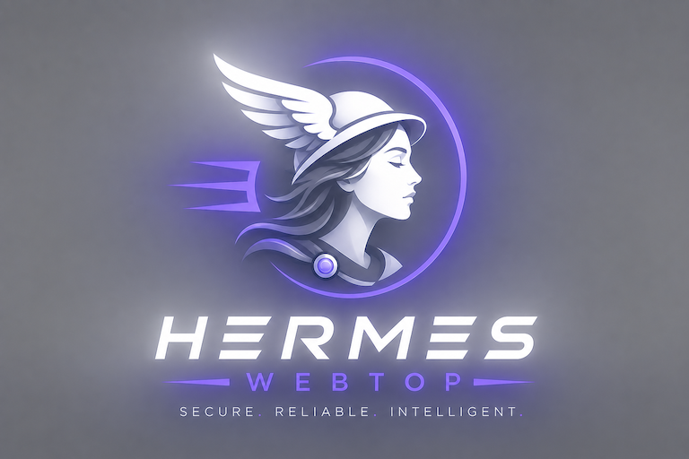
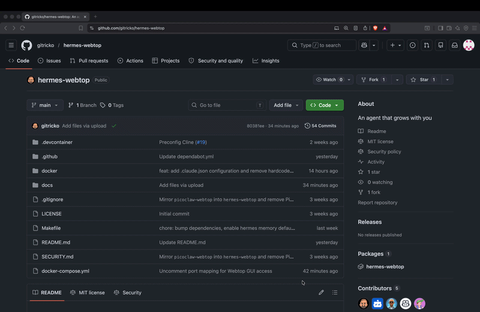
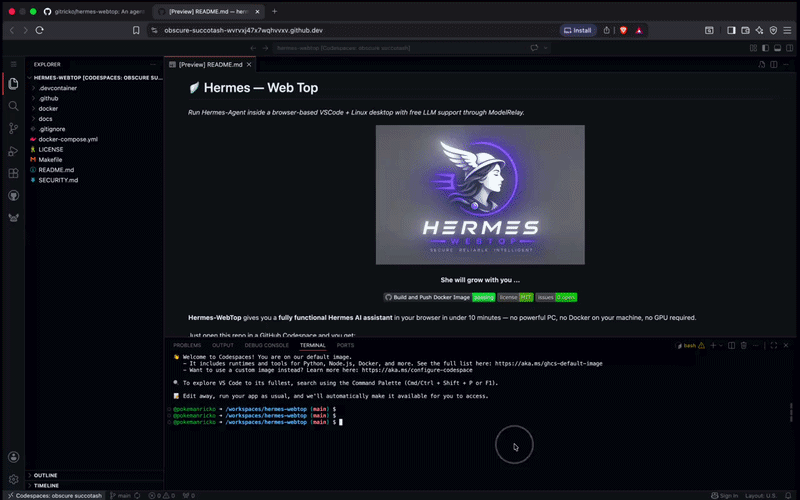
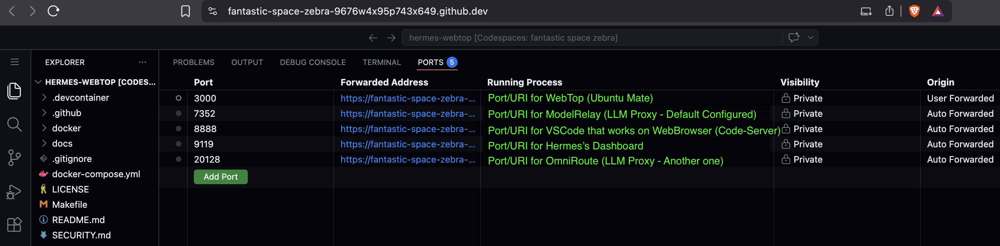
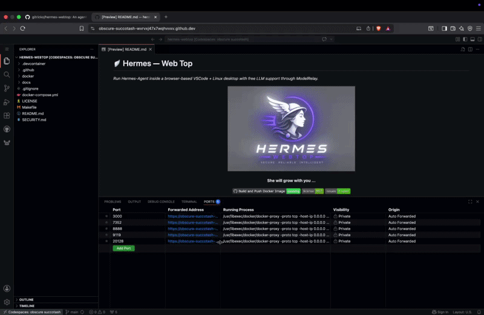

# 🪽 Hermes — Web Top
_Run Hermes-Agent inside a browser-based VSCode + Linux desktop with free LLM support through ModelRelay._

<p align="center">
    <picture>
        
    </picture>
</p>

<p align="center">
  <strong>She will grow with you ...</strong>
</p>

<p align="center">
<a href="https://github.com/gitricko/hermes-webtop/actions/workflows/docker-publish.yml">
    
  </a>
  <a href="LICENSE">
    
  </a>
  <a href="https://github.com/gitricko/hermes-webtop/issues">
    
  </a>
</p>

**Hermes-WebTop** gives you a **fully functional Hermes AI assistant** in your browser in under 10 minutes — no powerful PC, no Docker on your machine, no GPU required.

Just open this repo in a GitHub Codespace and you get:
- A complete Ubuntu MATE desktop (WebTop) for computer use
- CodeServer at port 8888 with Hermes Extension installed and preconfigured
- Ollama server pre-installed and auto-started
- ModelRelay pre-installed, auto-started and pre-configured as default model
- Hermes gateway accessible via desktop launcher
- [Mnemon](https://github.com/mnemon-dev/mnemon) as your Hermes default [memory provider](https://github.com/gitricko/hermes-plugin-mnemon)
- Persistent volume for your config and settings

When you're ready to go production, simply move the same Docker setup to your own machine or VPS.

## ✨ Why This Exists

Hermes is an AI agent framework that connects LLMs directly to your communication platforms (WhatsApp, Telegram, Slack, Discord, etc.) and can run cron jobs, spawn sub-agents, speak/listen, and give you a beautiful dashboard.

The only catch? You normally need a dedicated machine with GPU.
**Hermes-WebTop removes that catch completely.**

Perfect for:
- Trying Hermes-Agent risk-free
- Free LLM APIs through [ModelRelay](https://github.com/ellipticmarketing/modelrelay) or [OmniRoute](https://github.com/diegosouzapw/OmniRoute)
- Students / hackers / evaluators
- Anyone who wants a personal AI assistant without breaking the bank

## 🚀 Quick Start (5-10 minutes)

1. **Open this repository in a GitHub Codespace** (big green "Code" button → Codespaces → New)

   It is recommended that you use 4 cpu core and 16G codespace.

   

3. In the Codespace terminal run:
   ```bash
   make start
   ```
   

4. Wait ~60 seconds after first launch. It takes about 5-7 minutes if docker image is not loaded yet. When the web desktop URL appears in the Codespace Ports tab, click it.

   
   
   __Demo on pre-installed WebApps__
   
   

5. Use VSCode on Web (Code-Server) to interact wit your agents:

   - Interact with files system using VSCode on the browser
   - Interact with Hermes Agent using VSCode Extension OR via hermes-cli in the VSCode Terminal
   - Claude Code + Hermes (both using Terminal-Cli or VSCode Extension) shared the persistent memory via [mnemon](https://github.com/mnemon-dev/mnemon)  so that Hermes remembers what you did in Claude and vice-versa.
   - Use WebTop interface in port 3000 when you need to do computer-use 

   

6. Configure your Hermes with your favourite messaging app !

   - Recommendation: Watch Youtube ;-)

7. Last NOTE:
   - For localhost install.. just use http://localhost:[3000,8888,9119,7352,20128]
     
## 🔧 Features

- **Zero local install** — everything runs in browser via GitHub Codespaces
- **Free-tier friendly** — uses ModelRelay, Ollama daily cloud credits or NVIDIA Build API fallback
- **Persistent config** — docker volume backup and restore after Codespace recreation
- **Easy backup/restore** — `make backup` / `make restore`
- **One-command everything** — powerful Makefile + clean `docker-compose.yml`
- **Auto-start ModelRelay** — Default configuration for Free LLM API to Hermes
- **Auto-start OmniRoute** — You need some configuration before it work but it is flexible and powerful
- **Auto-start Ollama** — custom init script on WebTop boot
- **Colima / local Docker support** ready
- **Built-in code-server IDE** — browser-based VS Code on port `8888`
- **Multiple AI VSCode Extension preinstall/config with ModelRelay** - Cline, Hermes and ClaudeCode
- **Mnemon as default memory provider** - a knowledge store for Hermes with intent-aware recall, importance decay, and auto-deduplication

## 🧑‍💻 Built-in code-server IDE (VSCode on the Web - Interface to Agent)

This image includes `code-server` and exposes it on port `8888`.

- `code-server` is installed automatically in the container.
- The desktop launcher `CodeServer` starts it inside the WebTop environment.
- In Codespaces, use the forwarded private port `8888`.
- Locally, open `http://localhost:8888`.

> Note: this setup may use `code-server --auth none` in development, so keep port `8888` private. For local production use, secure it with an authenticated reverse proxy or firewall.

- Hermes Agent's Extension is preinstalled and configured in VSCode
- Cline Extension is also preinstall and configured to ModelRelay
- Start Hacking away in VSCode, use WebTop if you need to monitor agent do desktop-use operations. eg: Non-Headless Chrome debugging for instance / Linux Computer-Use

## 🔒 Security: Protected by GitHub Authentication

**The WebTop URI is automatically protected — no one else can reach it.**

GitHub Codespaces forwards ports **privately by default** (this is the setting the `make start` command uses). According to official [GitHub documentation](https://docs.github.com/en/enterprise-cloud@latest/codespaces/reference/security-in-github-codespaces):

> "All forwarded ports are private by default, which means that you will need to authenticate before you can access the port."
> "Privately forwarded ports: Are accessible on the internet, but **only the codespace creator can access them, after authenticating to GitHub**."

### How the protection actually works

- The URL you click in the **Ports** tab (`https://<your-codespace>-3000.app.github.dev`) is guarded by **GitHub authentication cookies**.
- These cookies expire every **3 hours** — you'll simply be asked to log in again (super quick).
- If someone tries to open the link in an incognito window, via curl, or from another computer without being logged into **your** GitHub account, they are redirected to the GitHub login page or blocked.
- You (and only you) can access the full Ubuntu desktop, the browser inside it, Ollama, Hermes, and everything else.

### Extra security layers built-in

- The entire environment runs in an **isolated GitHub-managed VM** — not on your laptop.
- Codespaces are **ephemeral**: delete the codespace and everything disappears (except the backed-up volume you control).
- TLS encryption is handled automatically by GitHub.
- The `GITHUB_TOKEN` inside the codespace is scoped only to this repo and expires when you stop/restart.
- We never set the port to "Public" or even "Private to Organization" — it stays strictly private to you.

**Bottom line**: This is actually **more secure** for experimentation than running Docker locally on your personal machine (no accidental exposure, no firewall holes, no persistent processes on your hardware).

**For production use** we still recommend moving the same Docker image to your own VPS or server with additional hardening (firewall, HTTPS reverse proxy, strong secrets, etc.). This Codespace version is perfect for safe testing and development.

## 💾 Backup & Restore

Your configuration and settings are persisted in a Docker volume.
The project includes convenient `make` targets to back up and restore this data in codespace:

```bash
make backup          # creates backup/hermes_config_backup.tar.gz
make restore         # restores from backup/hermes_config_backup.tar.gz
```

### When to Use It

- Migrating from GitHub Codespaces to a local machine or VPS
- Testing experimental changes without risking your current setup
- Quickly cloning your working environment into a fresh Codespace or container

### How to Migrate to a New Environment

- In your current environment, run `make backup`.
- Download the generated file: `backup/hermes_config_backup.tar.gz`.
- Place the file in the `backup/` folder of the new environment.
- Run `make restore`.

**💡 Tip:** Always back up before making significant changes. The restore process will overwrite the existing volume data, so test in a separate environment first if you're unsure.

## 🛠️ Advanced Usage

Run locally (no Codespaces)

```bash
make build-local             # especially if you modified the ./docker/Dockerfile
make start-locally-baked     # start from your local baked image
```

## 🤝 Contributing

This is a community project — every star, issue, or PR helps enormously!
Feel free to open issues for bugs or feature requests.

[](https://star-history.com/#gitricko/hermes-webtop&type=date&legend=top-left)

## 📄 License

MIT — see [LICENSE](./LICENSE)
